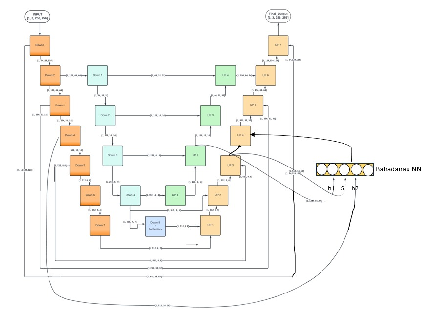

# Sketch Colorization Using UvUNet: A Custom Ensemble Generator



## Project Overview
This project aims to revolutionize sketch-to-photo synthesis by developing an advanced deep learning architecture for generating high-quality, colorized facial images from outline sketches. By introducing the UvU-Net Generator—a novel ensemble architecture—we address challenges in quality degradation, fine detail recovery, and structural consistency. This project finds applications in forensic facial reconstruction, content creation, and creative industries.

## Table of Contents
- [Motivation](#motivation)
- [Objectives](#objectives)
- [Proposed Solution](#proposed-solution)
- [UvU-Net Generator](#uvu-net-generator)
- [Project Structure](#project-structure)
- [Dataset](#dataset)
- [References](#references)
- [Results](#results)
- [How to Use](#how-to-use)
- [Acknowledgements](#acknowledgements)

---

## Motivation
Reconstructing realistic facial images from outline sketches is a complex task due to the intricacy of human facial features. Existing models often fall short in recovering fine details and maintaining visual fidelity. Our motivation stems from the need to bridge these gaps with a sophisticated system combining state-of-the-art image-to-image translation and super-resolution techniques.

---

## Objectives
- Develop a **CycleGAN-based model** to recover colored facial images from outlines.
- Create the **UvU-Net Generator**, a novel ensemble architecture for enhancing image quality and fidelity.
- Use advanced metrics such as **FID**, **PSNR**, and **SSIM** for performance evaluation.

---

## Proposed Solution
Our solution integrates two models into a seamless pipeline:
1. **CycleGAN**: Translates outline sketches to colored facial images.
2. **UvU-Net Generator**: Enhances the visual quality and recovers fine details using a novel ensemble method.

---

## UvU-Net Generator
The **UvU-Net Generator** is a custom ensemble architecture that combines:
- A **Discriminator** to ensure realistic outputs.
- A **Skip-Connected U-Net** for retaining structural details while upsampling.

---

## Project Structure
```plaintext
.
├── Ensemble_Architecture.pdf               # Detailed explanation of the ensemble architecture
├── Hyperparameter_Tuning.ipynb             # Hyperparameter tuning for CycleGAN
├── Hyperparameter_Tuning_Random_Search.ipynb
├── Main code snippets                      # Core model and utility scripts
│   ├── config.py
│   ├── Prepare_dataset.ipynb
│   ├── Trainer_UvU.ipynb
│   ├── utils.py
│   ├── UvU_Discriminator.py
│   └── UvU_Net_Generator.py
├── Output                                  # Generated outputs
│   ├── Pix2Pix Output
│   └── UvU Output
├── Sample_dataset                          # Input and Sobel-processed images
│   ├── input_images
│   ├── sobel_images
│   └── sobel_images1
├── UvU_Architecture.jpg                    # Visualization of the UvU-Net architecture
├── UvU_metric_analysis.ipynb               # Metric analysis for UvU-Net
├── README.md                               # Project README
├── regularization.py                       # Code for regularization techniques
```

## How to Use
1. Clone the repository:
   ```bash
   git clone https://github.com/VDNT11NULL/S2I.git
   ```
2. Install dependencies:
   ```bash
   pip install -r requirements.txt
   ```
3. Run the dataset preparation script:
   ```bash
   python Prepare_dataset.ipynb
   ```
4. Train the UvU-Net Generator:
   ```bash
   python Trainer_UvU.ipynb
   ```
---

## Dataset
The dataset used for this project includes input outline sketches and Sobel-processed images. Download the dataset from the following link:

[Dataset Link](https://drive.google.com/drive/folders/1-1KDpR3jGcd_21KgtmKCnDXiuc_W8NgP?usp=sharing)

---

---

## Results
### Pix2Pix Output


### UvU Output


### Metric Analysis
- **FID**: 34.7 (UvU-Net) vs. 45.2 (Pix2Pix)
- **PSNR**: 28.3 dB (UvU-Net)
- **SSIM**: 0.87 (UvU-Net)

For detailed analysis, refer to `UvU_metric_analysis.ipynb`.

---

## References
1. **Comparative Analysis of Pix2Pix and CycleGAN**  
   [ResearchGate Link](https://www.researchgate.net/publication/357301765_Comparison_and_Analysis_of_Image-to-Image_Generative_Adversarial_Networks_A_Survey)
2. **Bahdanau Attention Mechanism**  
   [ArXiv Paper](https://arxiv.org/abs/1409.0473)
